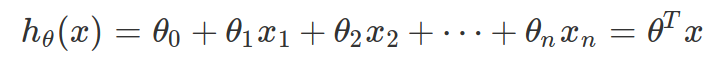

<h2>Table of Contents</h2>

<ul>
<li><a href="#sec-1">Python笔记</a>
<ul>
<li><a href="#sec-1-1">常用函数</a></li>
</ul>
</li>
<li><a href="#sec-2">Pandas库笔记</a>
<ul>
<li><a href="#sec-2-1">Series</a></li>
<li><a href="#sec-2-2">DataFrame</a></li>
</ul>
</li>
<li><a href="#sec-3">Numpy库笔记</a>
<ul>
<li><a href="#sec-3-1">Copy or View?</a></li>
<li><a href="#sec-3-2">数组的in place改变</a></li>
<li><a href="#sec-3-3">常用函数</a></li>
</ul>
</li>
<li><a href="#sec-4">数据集操作的一般过程（以Kaggle Titanic为例）</a>
<ul>
<li><a href="#sec-4-1">加载数据</a></li>
<li><a href="#sec-4-2">预览数据</a></li>
<li><a href="#sec-4-3">清理数据</a>
<ul>
<li><a href="#sec-4-3-1">3.3.1 Completing</a></li>
<li><a href="#sec-4-3-2">3.3.2 Creating</a></li>
<li><a href="#sec-4-3-3">3.3.3 Converting</a></li>
</ul>
</li>
<li><a href="#sec-4-4">从训练集中分离出测试集</a></li>
<li><a href="#sec-4-5">分析数据，找到关联性</a></li>
<li><a href="#sec-4-6">模型化数据集</a>
<ul>
<li><a href="#sec-4-6-1">背景知识</a></li>
</ul>
</li>
</ul>
</li>
<li><a href="#sec-5">注意点（摘自机器学习实战）</a></li>
<li><a href="#sec-6">机器学习实战</a>
<ul>
<li><a href="#sec-6-1">第四章 训练模型</a>
<ul>
<li><a href="#sec-6-1-1">4.1 线性回归 Linear Regression</a></li>
<li><a href="#sec-6-1-2">多项式回归 Polynomial Regression</a></li>
<li><a href="#sec-6-1-3">逻辑回归 Logistic Regression</a></li>
<li><a href="#sec-6-1-4">多元逻辑回归 Softmax Regression (Multinomial Regression)</a></li>
</ul>
</li>
</ul>
</li>
</ul>

# Python笔记

## 常用函数

    %timeit func() # 考查操作的运行时间
    map(func_obj, iter1, iter2) # 但是请尽量用生成器
    map(lambda x:x+1, iter1, iter2) # lambda表达式

# Pandas库笔记

## Series

    import pandas as pd
    pd.Series

## DataFrame

-   DataFrame中的方法属性：

    'T', 'abs', 'add', 'add_prefix', 'add_suffix', 'agg', 'aggregate', 'align', 'all',
    'any', 'append', 'apply', 'applymap', 'asfreq', 'asof', 'assign', 'astype',
    'at', 'at_time', 'attrs', 'axes', 'between_time', 'bfill', 'bool', 'boxplot',
    'clip', 'columns', 'combine', 'combine_first', 'convert_dtypes', 'copy', 'corr',
    'corrwith', 'count', 'cov', 'cummax', 'cummin', 'cumprod', 'cumsum', 'describe',
    'diff', 'div', 'divide', 'dot', 'drop', 'drop_duplicates', 'droplevel', 'dropna',
    'dtypes', 'duplicated', 'empty', 'eq', 'equals', 'eval', 'ewm', 'expanding',
    'explode', 'ffill', 'fillna', 'filter', 'first', 'first_valid_index', 'floordiv',
    'from_dict', 'from_records', 'ge', 'get', 'groupby', 'gt', 'head', 'hist', 'iat',
    'idxmax', 'idxmin', 'iloc', 'index', 'infer_objects', 'info', 'insert',
    'interpolate', 'isin', 'isna', 'isnull', 'items', 'iteritems', 'iterrows',
    'itertuples', 'join', 'keys', 'kurt', 'kurtosis', 'last', 'last_valid_index',
    'le', 'loc','lookup', 'lt', 'mad', 'mask', 'max', 'mean', 'median', 'melt',
    'memory_usage', 'merge', 'min', 'mod', 'mode', 'mul', 'multiply', 'ndim', 'ne',
    'nlargest', 'notna', 'notnull', 'nsmallest', 'nunique', 'pct_change', 'pipe',
    'pivot', 'pivot_table', 'plot', 'pop', 'pow', 'prod', 'product', 'quantile',
    'query', 'radd', 'rank', 'rdiv', 'reindex', 'reindex_like', 'rename',
    'rename_axis', 'reorder_levels', 'replace', 'resample','reset_index', 'rfloordiv',
    'rmod', 'rmul', 'rolling', 'round', 'rpow', 'rsub', 'rtruediv', 'sample',
    'select_dtypes', 'sem', 'set_axis', 'set_index', 'shape', 'shift', 'size',
    'skew', 'slice_shift', 'sort_index', 'sort_values', 'sparse', 'squeeze', 'stack',
    'std', 'style', 'sub', 'subtract', 'sum', 'swapaxes', 'swaplevel', 'tail', 'take',
    'to_clipboard', 'to_csv', 'to_dict', 'to_excel', 'to_feather', 'to_gbq', 'to_hdf',
    'to_html', 'to_json', 'to_latex', 'to_markdown', 'to_numpy', 'to_parquet',
    'to_period', 'to_pickle', 'to_records', 'to_sql', 'to_stata', 'to_string',
    'to_timestamp', 'to_xarray', 'transform', 'transpose', 'truediv', 'truncate',
    'tshift', 'tz_convert', 'tz_localize', 'unstack', 'update', 'values', 'var',
    'where', 'xs'

# Numpy库笔记

## Copy or View?

-   vew
    -   Slice view
    -   Dtype view
-   shallow copy
-   deep copy

## 数组的in place改变

以下是不同的操作过程：

    # y = np.arange(8)
    y += 1 # 更快
    y = y + 1 # 更慢

## 常用函数

    import numpy as np
    a = np.arange(3)
    b = np.arange(3,6)
    c = np.r_[a, b, 1, [3]] # 合并数组
    d = np.c_[a, b] # 合并数组
    e = np.ones((4, 1)) # 接收元组
    d.shape
    d.resize(2, 3) # 无返回值，将原数组形变，接收元组
    f = d.reshape(（2,3）) # 返回变形后的数组，原数组不变，接收元组

# 数据集操作的一般过程（以Kaggle Titanic为例）

疑问：
-   分离出测试集应该在预览数据之前还是之后？
-   清理数据时，是对整个数据集操作还是只对训练集操作？
-   交叉验证总是需要的吗？只是在出现过拟合时使用？

Jupyter Notebook:
[titanic-adatascienceframeworktoachieve99accuracy.ipynb](titanic-a_data_science_framework_to_achieve_99_accuracy.ipynb)

## 加载数据

Kaggle网站上Titanic竞赛中的数据集test.csv指求解时的实例，去掉了标签'Survived'.

    import pandas as pd
    df = pd.read_csv("train.csv") # , delimiter=',')
    df2 = pd.read_csv("test.csv") # , delimiter=',')

-   要注意Python中赋值时，引用与复制数据的区别！

    data1 = df.copy(deep=False) #不复制df的indices和数据，只创建一个指向原数据的引用
    data1 = df.copy(deep=True) #复制df的indices和数据，并在内存中创建新的对象

-   引用也是很有用的，尤其是在清理数据时（为什么要清理data-val？）

    data_clearner = [data1, df2] #可以一起清理

## 预览数据

    df.info()
    df.head()
    df.tail()
    df.sample(10)

## 清理数据

4个'C':
-   **Correcting**: 更正异常值，离群值
-   **Completing**: 补全缺失信息
-   **Creating**: 创建新的特征，用以之后的分析
-   **Converting**: 转换数据的格式，以备后续的计算与呈现

### 3.3.1 Completing

不推荐删除记录，尤其当它占的比例大时。最好impute. 对于定性值，
一般使用mode，对于定量值一般用中值、平均值或以平均值+随机化的标准差来代替。
还有针对具体问题更特殊的处理方法，如代之以某个小类别中的中值等。

    df.isna().sum() # 查看数据中的空值情况
    df.isnull().sum() # 查看数据中的空值情况
    df.describe(include='all') #数据的简单分析
    df['Age'].fillna(df['Age'].median(), inplace=True) # 用中值来补全空值（定量值）
    df['Embarked'].fillna(df['Embarked'].mode()[0], inplace=True)
    # 用出现最的类别来补全空值（定性值）
    drop_index = ['PassengerId', 'Ticket'] # index to drop
    df.drop(drop_index, axis=1, inplace=True) # drop features/columns

### 3.3.2 Creating

特征工程：用已经存在的特征来创造新的特征，以检查是否对结果预测提供新的信息。

    df['FamilySize'] = df.['SibSp'] + df.['Parch'] + 1 # 新建特征
    df['Alone'] = 0
    df['Alone'].loc[df['FamilySize'] > 1] = 1 # 选择性赋值
    df['Title'] = df['Name'].str.split( # 特征中字符串截取
       ', ', expand=True)[1].str.split('.', expand=True)[0]
    df['FareBins'] = pd.cut(df['Fare'], 4) # 离散化连续值到区间
    df['AgeBins'] = pd.qcut(df['Age'].astype(int), 5) # 离散化连续值到区间
    # 清理类别数太少的类别
    title_name = df['Title'].value_counts() < 10
    df['Title'] = df['Title'].apply(lambda x: 'Misc' if title_name[x] else x)

### 3.3.3 Converting

如对object类型的数据格式化，使算法可以处理。

    from sklearn.preprocessing import LabelEncoder OneHotEncoder
    # 数字型编码
    encoder = LabelEncoder()
    df['Sex']  = encoder.fit_transform(df['Sex'])
    # 独热向量编码， 接收二维数组
    encoder2 = OneHotEncoder()
    df['Sex']  = encoder2.fit_transform(df['Sex'].reshape(-1,1))

## 从训练集中分离出测试集

两种方法：
-   固定比例分离

    train1_x, test1_x, train1_y, test1_y = model_selection.train_test_split(data1[data1_x_calc], data1[Target], random_state = 0)

-   交叉验证（用以比较模型）

    model_selection.cross_val_score()

## 分析数据，找到关联性

    df[['Sex', 'Survived']].groupby('Sex',as_index=False).mean() # 特定特征与标签的关系
    # 图示某一个特征与标签的关系
    plt.hist(x = [df[df['Survived']==1]['Fare'], df[df['Survived']==0]['Fare']],
             stacked=True, color = ['g','r'],label = ['Survived','Dead'])
    plt.title('Fare Histogram by Survival')
    plt.xlabel('Fare ($)')
    plt.ylabel('# of Passengers')
    plt.legend()
    # 图示某两个特征与标签的关系
    sns.violinplot(x = 'Pclass', y = 'Age', hue = 'Survived', data = data1, split = True, ax = axis2)
    axis2.set_title('Pclass vs Age Survival Comparison')
    # Pearson关联
    df.corr()

Pearson关联的绘图函数：

    #correlation heatmap of dataset
    def correlation_heatmap(df):
        _ , ax = plt.subplots(figsize =(14, 12))
        colormap = sns.diverging_palette(220, 10, as_cmap = True)

        _ = sns.heatmap(
            df.corr(),
            cmap = colormap,
            square=True,
            cbar_kws={'shrink':.9 },
            ax=ax,
            annot=True,
            linewidths=0.1,vmax=1.0, linecolor='white',
            annot_kws={'fontsize':12 }
        )

        plt.title('Pearson Correlation of Features', y=1.05, size=15)

    correlation_heatmap(data1)

## 模型化数据集

### 背景知识

机器学习算法可以分为四个部分：
-   分类
-   回归
-   聚类
-   降维

机器学习知识：
-   [Sklearn Estimator Overview](https://scikit-learn.org/stable/user_guide.html)
-   [Sklearn Estimator Detail](https://scikit-learn.org/stable/modules/classes.html)
-   [Choosing Estimator Mind Map](https://scikit-learn.org/stable/tutorial/machine_learning_map/index.html)

-   [Choosing Estimator Cheat Sheet](https://s3.amazonaws.com/assets.datacamp.com/blog_assets/Scikit_Learn_Cheat_Sheet_Python.pdf)

解决有监督的分类问题的算法：
-   Ensemble Methods
-   Generalized Linear Models (GLM)
-   Naive Bayes
-   Nearest Neighbors
-   Support Vector Machines (SVM)
-   Decision Trees
-   Discriminant Analysis

# 注意点（摘自机器学习实战）

-   对收入分层抽样，不能分太多层
-   分层方法：除以1.5，向上取整；然后合并大于5的分类
-   地理数据可视化，用其他相关属性作为颜色，和散点大小
-   寻找与标签相关性高的属性，用df.corr()['labels']
-   进一步考察高相关性属性的数据模式，并删除可能的错误数据
-   尝试不同的属性组合，以找到高相关性特征
-   将预测器与标签分离，因为可能不一定对它们使用相同的转换方式
-   特征缩放（归一化、标准化），即同比缩放所有属性
-   评估训练得的模型，对训练集求RMSE或MAE
-   误差较大则拟合不足，可以
-   误差过小？则用验证集来验证得到的模型，以检查是否过拟合
-   交叉验证，可以sklearn的K-fold功能
-   如果在验证集上得到的误差大则说明确实有过拟合，需要更换模型
-   尝试多个模型以找到2-5个有效的模型，别花太多时间去调整超参数
-   保存每个尝试过的模型，用pickel或sklearn的joblib
-   训练集分数明显低于验证集分数，则过度拟合
-   注意：目标值一般不进行绽放，并且只对训练集缩放

# 机器学习实战

## 第四章 训练模型

### 4.1 线性回归 Linear Regression

用以描述线性化数据集，模型或假设（hypothesis）是特征（x）的线性函数,或者写成向量形式，令\(x_0 = 1\):

\begin{equation}
\hat{y} = \theta_0 + \theta_1 x_1 + \theta_2 x_2 + \cdots + \theta_n x_n
\end{equation}

上面的表达式也称之为回归方程（regression equation），\\theta为回归系数。
成本函数，MSE函数：

-   4.1.1 闭式解-标准方程（normal equation）

    即直接通过解析表达式计算得到参数向量&theta;:

    

    可以使用Numpy的线性代数模块np.linalg中的inv()函数来求矩阵逆，用dot()方法计算内积。
    特征数量大时标准方程计算极其缓慢，此时可以用迭代优化法。

    **注意** ：

        书中有误，Scikit-Learn的LinearRegression类并不是标准方程的实现，而是基于X的SVD分解。其时间复杂度为O(n^2)，在m<n或特征线性相关时依然可以工作（标准方程不行，因为不满秩）。
        LinearRegression类不需要对特征进行标度。

        from sklearn.linear_model import LinearRegression
        lin_reg = LinearRegression() # 基于scipy.linalg.lstsq()
        lin_reg.fit(X, y)
        lin_reg.intercept_, lin_reg.coef_ # 偏置\theta_0与权重\theta_i
        lin_reg.predict(X_new) # 预测
        # 可能直接调用lstsq()，意为最小平方
        theta_best_svd, residuals, rank, s = np.linalg.lstsq(X_b, y, rcond=1e-6)
        theta_best_svd

-   4.1.2 梯度下降(迭代优化)

    从随机值开始，每一步降低成本函数，直到成本函数最小值。每一步的步长取决于超参数: *学习率* *&eta;* ( *learning rate* ).

    **注意** ：

    -   线性回归模型的MSE是凸函数，没有局部最小，只一个全局最小。
    -   应用梯度下降时要保证所有特征数值大小比例差不多，即要先进行特征缩放！
    -   特征缩放主要有两种方式：standerization和normalization，见第二章，68页。
    -   可以使用sklearn的StandardScaler类。
    -   学习率的选取很关键，可以限制迭代次数进行网格搜索。

    -   4.1.2.1 批量梯度下降

        在计算梯度下降的每一步时，都基于整个训练集。训练集庞大时很耗时，但随特征数增大时，算法表现良好。

    -   4.1.2.2 随机梯度下降

        在计算梯度下降的每一步时，只随机地使用一个训练集实例。训练集庞大时很耗时，但随特征数增大时，算法表现良好。
        -   当成本函数有局部最小时，可以跳出局部最小，找到全局最小
        -   设定 *学习计划* ，开始时大步长，最后小步长（模拟退火）
        -   乱序训练集使一个接一个地使用实例，反而会导致收敛更慢！

            from sklearn.linear_model import SGDRegressor
            sgd_reg = SGDRegressor(max_iter=50, tol=-np.infty, penalty=None, eta0=0.1, random_state=42)
            sgd_reg.fit(X, y.ravel())
            sgd_reg.intercept_, sgd_reg.coef_

    -   4.1.2.3 小批量梯度下降

        在计算梯度下降的每一步时，只随机地使用一个小的实例集。主要优势在于可以用GPU加速计算。

-   4.1.3 标准方程与梯度下降对比

    

### 多项式回归 Polynomial Regression

### 逻辑回归 Logistic Regression

### 多元逻辑回归 Softmax Regression (Multinomial Regression)